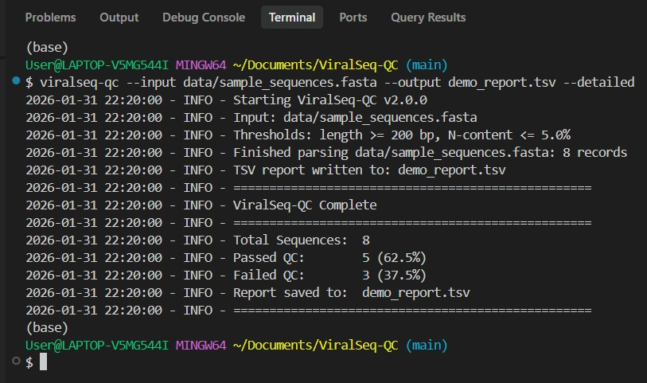

# ViralSeq-QC

[](https://www.python.org/downloads/)
[](https://opensource.org/licenses/MIT)
[](https://github.com/Qasim-Hussain-Code/ViralSeq-QC/actions)

**ViralSeq-QC** is a zero-dependency CLI toolkit for quality control of viral consensus sequences. It performs rigorous pre-processing by filtering artifacts based on length, ambiguity (N-content), sequence complexity, and other bioinformatics metrics.



## Features

- **Zero Dependencies** - Pure Python 3, no external packages required
- **Streamed Processing** - Memory-efficient handling of large FASTA files
- **Comprehensive QC Metrics**:
  - Sequence length validation
  - N-content (ambiguity) filtering
  - GC content calculation
  - Sequence complexity analysis
  - Homopolymer run detection
  - Terminal N detection
- **Multiple Output Formats** - TSV, JSON, and filtered FASTA
- **Gzip Support** - Read compressed `.fasta.gz` files directly
- **Fully Tested** - Comprehensive pytest test suite

## Installation

### From Source (Recommended)

```bash
git clone https://github.com/Qasim-Hussain-Code/ViralSeq-QC.git
cd ViralSeq-QC

# Install in development mode
pip install -e .
```

### As a Module

```bash
git clone https://github.com/Qasim-Hussain-Code/ViralSeq-QC.git
cd ViralSeq-QC

# Run directly as a module
python -m src.main --help
```

## Quick Start

```bash
# Basic usage
viralseq-qc --input sequences.fasta --output qc_report.tsv

# With custom thresholds
viralseq-qc --input raw.fasta --output report.tsv --min-length 1000 --max-n 2.0

# Output in JSON format
viralseq-qc --input raw.fasta --output report.json --json

# Save passing sequences to new FASTA
viralseq-qc --input raw.fasta --output report.tsv --fasta-out passed.fasta
```

## Usage

### Command-Line Options

| Option | Description | Default |
|--------|-------------|---------|
| `--input`, `-i` | Path to input FASTA file (supports `.gz`) | **Required** |
| `--output`, `-o` | Path to output QC report | **Required** |
| `--min-length` | Minimum sequence length (bp) | 200 |
| `--max-n` | Maximum allowed N-content (%) | 5.0 |
| `--min-complexity` | Minimum sequence complexity (0-1) | 0 (disabled) |
| `--json` | Output report in JSON format | False |
| `--fasta-out` | Write passing sequences to FASTA | None |
| `--failed-out` | Write failing sequences to FASTA | None |
| `--detailed` | Include all QC metrics in report | False |
| `--verbose`, `-v` | Enable verbose debug output | False |
| `--quiet`, `-q` | Suppress all output except errors | False |
| `--version` | Show version and exit | - |

### Examples

#### SARS-CoV-2 Quality Control

Filter for complete, high-quality SARS-CoV-2 genomes:

```bash
viralseq-qc \
    --input sars_cov2_sequences.fasta \
    --output qc_report.tsv \
    --min-length 29000 \
    --max-n 1.0 \
    --fasta-out high_quality_genomes.fasta \
    --detailed
```

#### HIV Sequence Processing with JSON Output

```bash
viralseq-qc \
    --input hiv_sequences.fasta.gz \
    --output hiv_qc_report.json \
    --json \
    --min-length 500 \
    --max-n 3.0
```

#### Batch Processing with All Outputs

```bash
viralseq-qc \
    --input raw_viral_sequences.fasta \
    --output full_report.tsv \
    --fasta-out passed_qc.fasta \
    --failed-out failed_qc.fasta \
    --detailed \
    --verbose
```

## Output Formats

### TSV Report (Default)

```
sequence_id	length	gc_content	n_content	status
seq_001	29903	37.97	0.12	PASS
seq_002	15234	38.24	12.45	FAIL
```

### JSON Report (with `--json`)

```json
{
  "results": [
    {
      "sequence_id": "seq_001",
      "length": 29903,
      "gc_content": 37.97,
      "n_content": 0.12,
      "status": "PASS"
    }
  ],
  "summary": {
    "total_sequences": 100,
    "passed": 87,
    "failed": 13,
    "pass_rate": 87.0
  }
}
```

### Detailed Report (with `--detailed`)

Additional columns: `complexity`, `homopolymer_count`, `5_prime_ns`, `3_prime_ns`

## Python API

Use ViralSeq-QC as a library in your Python scripts:

```python
from src import parse_fasta, is_high_quality, get_sequence_metrics

# Process sequences
for header, sequence in parse_fasta("input.fasta"):
    if is_high_quality(sequence, min_length=1000, max_n_content=2.0):
        metrics = get_sequence_metrics(sequence)
        print(f"{header}: GC={metrics['gc_content']:.1f}%")
```

## QC Metrics Explained

| Metric | Description | Typical Threshold |
|--------|-------------|-------------------|
| **Length** | Sequence length in base pairs | ≥200 bp (fragments), ≥29000 bp (complete SARS-CoV-2) |
| **N-content** | Percentage of ambiguous bases | ≤5% (lenient), ≤1% (strict) |
| **GC-content** | Percentage of G+C bases | Virus-dependent (SARS-CoV-2: ~38%) |
| **Complexity** | K-mer diversity score (0-1) | ≥0.3 (optional filter) |
| **Homopolymers** | Long single-nucleotide runs | Informational (sequencing artifacts) |
| **Terminal N's** | N's at sequence ends | Informational (assembly artifacts) |

## Development

### Running Tests

```bash
# Install dev dependencies
pip install -e ".[dev]"

# Run tests
pytest tests/ -v

# With coverage
pytest tests/ --cov=src --cov-report=html
```

### Type Checking

```bash
mypy src/ --ignore-missing-imports
```

### Linting

```bash
ruff check src/ tests/
```

## Contributing

Contributions are welcome! Please:

1. Fork the repository
2. Create a feature branch (`git checkout -b feature/amazing-feature`)
3. Make your changes
4. Run tests (`pytest tests/`)
5. Submit a Pull Request

## License

MIT License - see [LICENSE](LICENSE) for details.

## Citation

If you use ViralSeq-QC in your research, please cite:

```
ViralSeq-QC: A zero-dependency toolkit for viral genome quality control
https://github.com/Qasim-Hussain-Code/ViralSeq-QC
```

## Acknowledgments

Developed for viral genomics surveillance and bioinformatics quality control workflows.